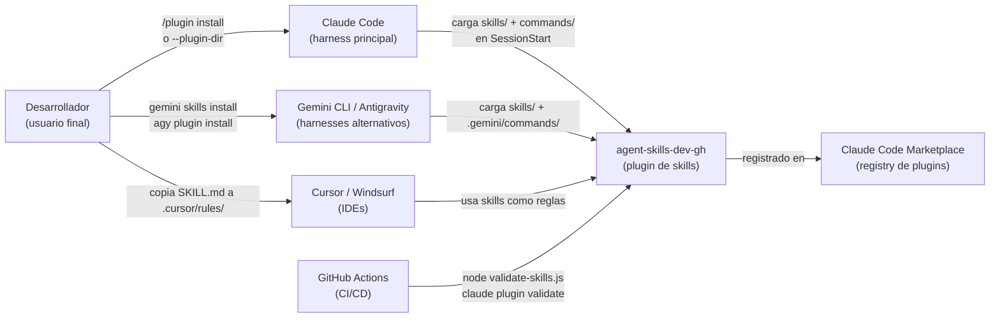
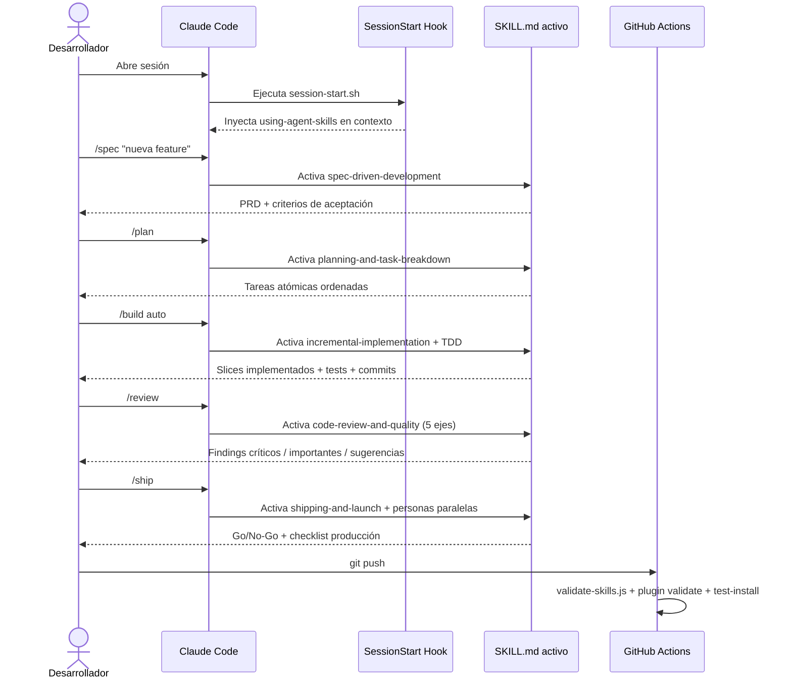
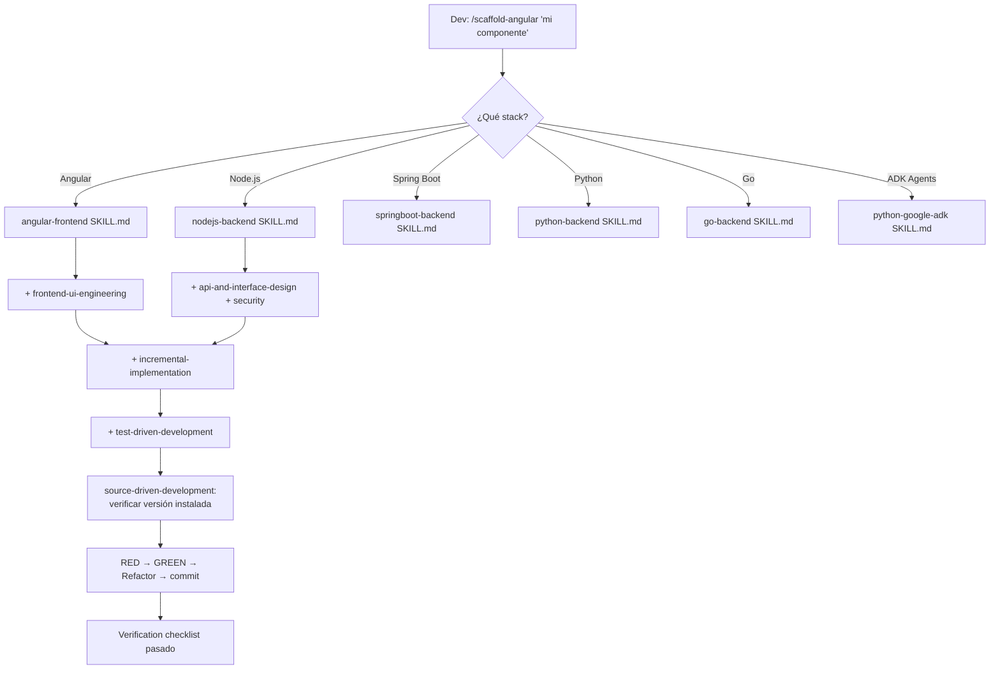
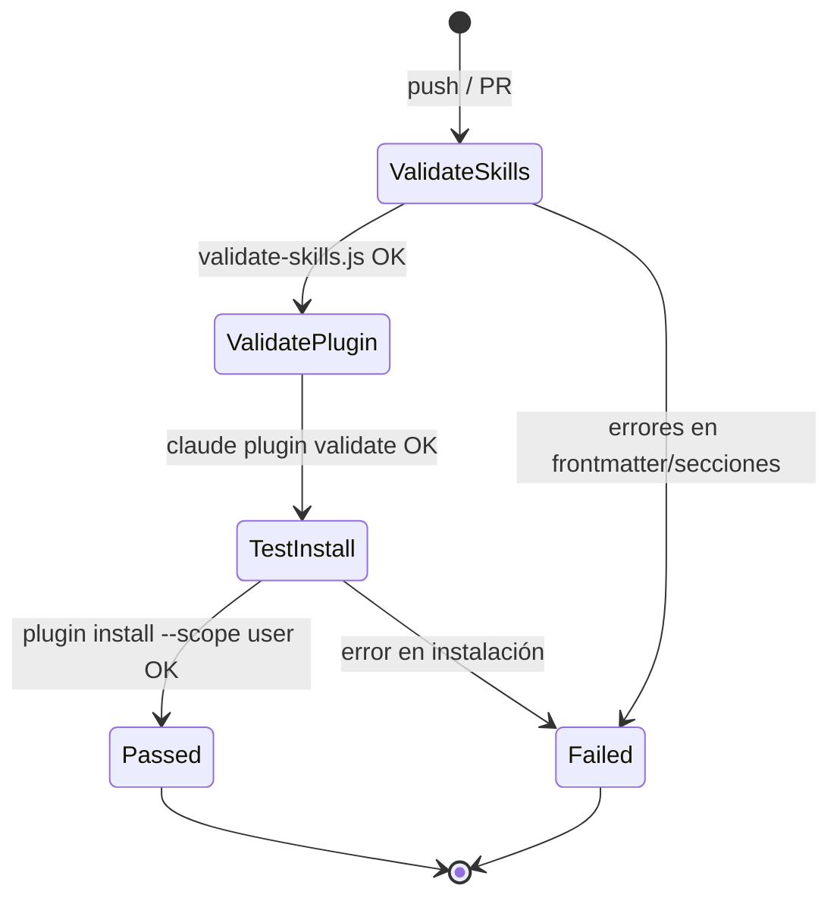

# agent-skills-dev-gh

> Librería de skills de ingeniería de producción para agentes de IA — fork extendida para el stack del proyecto, que cubre el ciclo completo Define → Plan → Build → Verify → Review → Ship.

---

## 1. ¿Qué es y para qué sirve?

`agent-skills-dev-gh` es una **colección de workflows estructurados en Markdown** que se instalan en agentes de IA (Claude Code, Gemini CLI, Cursor, Antigravity, Windsurf, etc.) para que sigan prácticas de ingeniería de producción consistentes. Cada "skill" encapsula el proceso que un senior engineer aplica en una fase del ciclo de desarrollo: cómo escribir un spec, cómo hacer TDD, cómo revisar código, cómo hacer deploy seguro, etc.

El repo es un **fork de `addyosmani/agent-skills`** (v1.0.0, autoría Addy Osmani, MIT) al que se le añadió una capa de skills y comandos específicos del stack del proyecto: Angular, Node.js, Spring Boot (Java 21/Maven), Python/FastAPI, Go y Google ADK 2.0. La base original permanece intacta; las extensiones están claramente documentadas en `STACK-EXTENSIONS.md`.

**¿Quién lo usa?** Equipos de desarrollo que trabajan con asistentes de IA (principalmente Claude Code). El agente descubre las skills automáticamente al arrancar la sesión (vía hook `SessionStart`) o las activa cuando el usuario invoca un comando `/scaffold-*`, `/build`, `/spec`, etc.

**¿Cómo encaja en un sistema mayor?** Es una dependencia de configuración: se instala como plugin en Claude Code (`/plugin install`) y como directorio de skills en otros harnesses. No tiene runtime propio — es puro contenido que se inyecta en el contexto del agente.

---

## 2. Stack tecnológico

| Capa | Tecnología | Versión | Rol |
|------|-----------|---------|-----|
| Runtime (validación) | Node.js | ≥ 20 | Ejecutar `scripts/validate-skills.js` en CI |
| Formato de skills | Markdown + YAML frontmatter | — | Definición de workflows de agentes |
| Comandos Claude Code | Markdown (`.claude/commands/`) | — | Slash commands auto-descubiertos por Claude Code |
| Comandos Gemini / Antigravity | TOML (`.gemini/commands/`, `commands/`) | — | Slash commands en otros harnesses |
| Plugin manifest | JSON (`plugin.json`, `.claude-plugin/`) | — | Registro en marketplace de Claude Code |
| Hooks | Shell scripts + `hooks.json` | — | Inyección del meta-skill en `SessionStart` |
| CI/CD | GitHub Actions | — | Validación de skills + smoke-test de instalación |
| Licencia | MIT | — | Uso libre en proyectos y equipos |

No hay base de datos, servidor HTTP, dependencias npm de producción, ni variables de entorno. Es un proyecto de documentación ejecutable.

---

## 3. Integraciones externas

| Servicio | Tipo | Propósito | Configuración |
|----------|------|-----------|---------------|
| GitHub marketplace de Claude Code | Plugin registry | Instalación vía `/plugin marketplace add` | `repository` en `.claude-plugin/plugin.json` |
| Antigravity CLI | Plugin registry | Instalación vía `agy plugin install` | `plugin.json` raíz |
| GitHub Actions | CI/CD | Validar skills + probar instalación del plugin | `.github/workflows/test-plugin-install.yml` |

Las skills en sí referencian servicios externos (Anthropic API, Google ADK, etc.) pero **el repo no se conecta a ninguno** — esas integraciones ocurren en los proyectos donde el desarrollador usa las skills.

---

## 4. Arquitectura — Diagrama C1 (Contexto del sistema)



---

## 5. Flujos de trabajo

### Flujo 1: Ciclo de desarrollo guiado por skills



### Flujo 2: Activación de scaffold de stack extendido



### Flujo 3: Pipeline de CI



---

## 6. Cómo se usa — Guía paso a paso

### Paso 1: Prerrequisitos

```bash
# Claude Code CLI instalado
claude --version   # >= cualquier versión reciente

# O Node.js 20+ para solo correr validaciones
node --version     # >= 20
```

### Paso 2: Instalación en Claude Code (marketplace)

```bash
# Desde el marketplace remoto (origin: addyosmani/agent-skills)
/plugin marketplace add addyosmani/agent-skills
/plugin install agent-skills@addy-agent-skills

# Desde el clone local de este repo
claude --plugin-dir /ruta/a/agent-skills-dev-gh
```

### Paso 3: Instalación en Gemini CLI

```bash
gemini skills install ./agent-skills-dev-gh/skills/
```

### Paso 4: Instalación en Antigravity CLI

```bash
agy plugin install ./agent-skills-dev-gh
```

### Paso 5: Instalación en Cursor / Windsurf

```bash
# Copiar una skill específica como regla
cp skills/angular-frontend/SKILL.md .cursor/rules/angular-frontend.md
```

### Paso 6: Validar el repo localmente

```bash
cd /ruta/a/agent-skills-dev-gh
node scripts/validate-skills.js
# Salida esperada: "32 skills checked — 0 error(s), 0 warning(s) — PASSED"
```

### Paso 7: Usar las skills desde Claude Code

```
/spec    → Define qué construir (PRD)
/plan    → Descompone en tareas atómicas
/build   → Implementa en slices (opcionalmente /build auto para modo autónomo)
/test    → TDD: red → green → refactor
/review  → Code review 5 ejes
/ship    → Pre-launch checklist paralelo

# Scaffolders de stack extendido:
/scaffold-angular   "tabla de productos con filtros"
/scaffold-springboot "endpoint POST /orders con validación"
/scaffold-python    "servicio FastAPI de autenticación"
/scaffold-adk       "agente multi-step de procesamiento de reservas"
```

---

## 7. Ejemplos de uso

### Ejemplo 1: Iniciar un feature Angular con TDD

```
/scaffold-angular componente de listado de paquetes turísticos con filtros por precio y destino
```

El agente:
1. Consulta `source-driven-development` para verificar la versión de Angular instalada
2. Define el boundary del componente (presentational + smart)
3. Escribe test fallido (RED) con Testing Library consultando por `role`
4. Implementa el mínimo con signals + OnPush (GREEN)
5. Hace refactor, commit atómico
6. Verifica accessibility checklist (WCAG 2.1 AA)

### Ejemplo 2: Build autónomo de un endpoint Spring Boot

```
/scaffold-springboot endpoint POST /api/v1/reservas — recibe ReservaRequest, valida, persiste, retorna 201
```

El agente compone:
- `springboot-backend` → arquitectura @RestController / @Service / @Repository
- `api-and-interface-design` → contract-first, error semantics RFC 9457
- `security-and-hardening` → validación Bean Validation, no secrets en código
- `incremental-implementation` → slice por slice, feature flag si aplica
- `test-driven-development` → JUnit 5 + Mockito, test de integración con TestContainers

### Ejemplo 3: Validar skills en CI (GitHub Actions)

```yaml
# Trigger automático en cada push
- name: Validate all skills
  run: node scripts/validate-skills.js
# Verifica: frontmatter válido, name == dirname, secciones obligatorias, refs cruzadas
```

---

## 8. Cuadro resumen

| Dimensión | Detalle |
|-----------|---------|
| **Tipo de sistema** | Librería de documentación ejecutable (plugin para agentes de IA) |
| **Lenguaje principal** | Markdown (skills) + Node.js (validación CI) + Shell (hooks) |
| **Framework core** | Ninguno — auto-descubrimiento por Claude Code plugin system |
| **Base de datos** | Ninguna |
| **Autenticación** | No aplica |
| **Comunicación** | No aplica (es un plugin, no un servicio) |
| **Testing** | `scripts/validate-skills.js` (frontmatter + secciones + refs cruzadas) |
| **Containerizado** | No |
| **CI/CD** | GitHub Actions (validate-skills → plugin validate → test-install) |
| **Skills totales** | 32 (24 base + 8 extensiones de stack) |
| **Comandos** | 17 slash commands (9 originales + 8 scaffold de stack) |
| **Agentes / personas** | 4 (code-reviewer, test-engineer, security-auditor, web-performance-auditor) |
| **Referencias** | 5 checklists (testing, security, performance, accessibility, orchestration) |
| **Harnesses soportados** | Claude Code, Gemini CLI, Antigravity, Cursor, Windsurf, OpenCode, Copilot, Kiro |
| **Estado del proyecto** | Desarrollo activo — extensión de stack sobre base estable |
| **Complejidad estimada** | Baja (sin runtime propio) / Media (coordinación multi-harness) |
