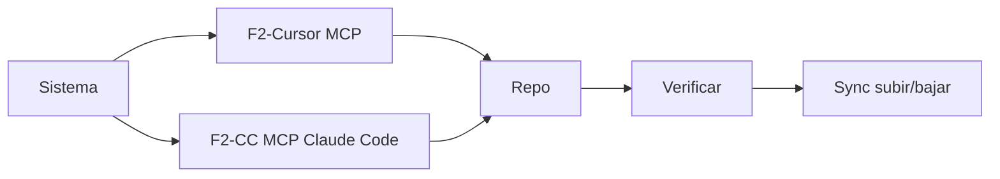

# Configurar Engram — Cursor y/o Claude Code (Windows / macOS)

Skill de **setup e instalación** (F1–F5) y **rutinas de operación** (G–I) con soporte para **Cursor** y **Claude Code** en el mismo flujo.

La **operación diaria** la cubre:
- **Cursor:** rule `engram.mdc` (F3.3) + MCP Engram.
- **Claude Code:** sección `## Engram` en `CLAUDE.md` (F3.4) + MCP Engram global.

No saltar fases en instalación **completa** (modo A); en modos parciales, ejecutar solo las fases indicadas.

> **Producto:** Engram local (`keggan-std/Engram`, CLI `engram`). **No** es getengram.app (cloud/API key).
> **`engram setup` (menú 1–5):** OpenCode, Claude Code, Gemini, Codex… **No incluye Cursor.**

> **Operación diaria:** rule **`engram.mdc`** (Cursor) o sección **`## Engram`** en `CLAUDE.md` (Claude Code) + MCP. Modos **G–I** aquí; esas instrucciones ejecutan G–H cuando el usuario lo pide.

### Relación con `configurar-engram` (solo Cursor)

| Skill | Cuándo usarla |
|-------|---------------|
| **`configurar-engram`** | Equipo usa **solo Cursor**; skill más corta, `reference/` completa para Cursor |
| **`configurar-engram-multiide`** (esta) | Equipo usa **Claude Code** y/o **ambos IDEs** en el mismo repo |

Plantillas autocontenidas: [`reference/`](reference/).

---

## Las cinco fases (mapa)

| Fase | Ámbito | Qué configura | Artefactos / comandos clave |
|------|--------|---------------|-----------------------------|
| **F1 — Sistema** | SO + PATH + datos globales | Binario `engram`, PATH, `ENGRAM_DATA_DIR` opcional | `engram version`, `~/.engram/engram.db` |
| **F2-Cursor — MCP Cursor** | IDE Cursor | MCP **por repo** o **global** | `DEST_ROOT/.cursor/mcp.json` y/o `~/.cursor/mcp.json` |
| **F2-CC — MCP Claude Code** | Claude Code CLI | MCP scope `user` (global) o `project` (repo) | `claude mcp add -s user\|project engram -- ...` |
| **F3 — Repo** | Proyecto Git | Anclaje + instrucciones para el agente | `.engram/config.json`, `.gitignore`, `engram.mdc` (Cursor) y/o sección en `CLAUDE.md` (CC) |
| **F4 — Verificación** | Todo lo anterior | Comprobar que quedó OK | `engram doctor`, `mem_current_project`, prueba `mem_save` / CLI |
| **F5 — Sync contextos** | Repo + Git (+ opcional JSON) | **Subir** y **bajar** memorias entre máquinas/equipo | `engram sync`, `git`, `engram sync --import` |



---

## Inicio — IDE destino, modo y `DEST_ROOT`

**Preguntar siempre al inicio**, antes de cualquier acción:

### 1. ¿Para qué IDE se configura Engram?

| Opción | Qué configura |
|--------|--------------|
| **A) Cursor** | F2-Cursor + rule `engram.mdc` en F3.3 |
| **B) Claude Code** | F2-CC + sección `## Engram` en `CLAUDE.md` en F3.4 |
| **C) Ambos** | F2-Cursor + F2-CC + ambos artefactos en F3 |

Si el usuario no especifica IDE, preguntar explícitamente antes de continuar.

### 2. ¿Qué modo?

| Modo | Fases | Cuándo |
|------|--------|--------|
| **A — Completo** (default) | F1 → F2 → F3 → F4 → F5 | Repo nuevo sin Engram |
| **B — Solo verificar** | F4 | «verifica Engram», health check |
| **C — Solo sync** | F5 | «sync engram», subir/bajar chunks |
| **D — Solo sistema** | F1 | CLI no encontrado |
| **E — Solo Cursor MCP** | F2-Cursor | Solo Cursor MCP |
| **E-CC — Solo Claude Code MCP** | F2-CC | Solo Claude Code MCP |
| **F — Solo repo** | F3 | Solo config.json + rule/CLAUDE.md |
| **G — Comenzar día** | Operación | «comenzar el día», «iniciar sesión de trabajo» |
| **H — Finalizar día** | Operación | «finalizar el día», «cerrar sesión» |
| **I — Consultar ID** | Operación | «detalle memoria #N», «observación 76», «timeline engram» |

**`DEST_ROOT`:** ruta absoluta obligatoria en modos **A–F** (no inferir en multi-root). En **G–H**, usar el repo activo; si hay multi-root, confirmar **`PROJECT_NAME`**.

**`PROJECT_NAME`:** por defecto basename de `DEST_ROOT`.

**Alcance MCP Cursor (modo A o E):** preguntar y documentar la elección.

| Opción | Cuándo | Acción |
|--------|--------|--------|
| **Por repo** (recomendado) | Multi-root, equipo, varios proyectos | `DEST_ROOT/.cursor/mcp.json`; commitear rule `engram.mdc` |
| **Global** | Un solo repo habitual | `~/.cursor/mcp.json` — ver **Warning MCP global** en F2-Cursor |
| **Ambos** | Solo migración puntual | Evitar en operación normal; duplica servidores en Cursor |

Plantillas: [`reference/`](reference/).

---

## Comando slash (opcional)

| Comando | Uso |
|---------|-----|
| `/configurar-engram-multiide` | Entrada única; pregunta IDE destino y modos A–F según intención |

Modos B–F sin slash: «verifica Engram», «sync engram», etc. — la skill infiere la fase.

Modos **G–H** (jornada): «comenzar el día», «finalizar el día» — ver **Modo G** / **Modo H**.

Modo **I** (consulta por ID): «detalle memoria #N», «timeline engram N» — ver **Modo I**.

> **Solo Cursor:** usar `/configurar-engram` o `@configurar-engram`.

---

## Checklist — modo A completo (Cursor)

Usar cuando IDE destino = **Cursor** o **Ambos**.

- [ ] **0** Confirmar IDE = Cursor, modo A, ruta absoluta `DEST_ROOT` y `PROJECT_NAME`
- [ ] **1** Alcance MCP Cursor: ofrecer **por repo** (recomendado) o **global**; si global, entregar warning (§ F2-Cursor); si coexisten, advertir duplicados
- [ ] **2** `engram version` — si falla, instalar y PATH (F1)
- [ ] **3** `which engram` (macOS/Linux) o `where engram` (Windows) (F1)
- [ ] **4** Crear o actualizar `DEST_ROOT/.cursor/mcp.json` (F2-Cursor)
- [ ] **5** Cursor → Settings → MCP → **Refresh**; servidor engram sin error
- [ ] **6** Crear `DEST_ROOT/.engram/config.json` con `project_name` (F3.1)
- [ ] **7** Añadir bloque Engram en `.gitignore` del repo (F3.2)
- [ ] **8** Copiar rule `engram.mdc` desde catálogo; sustituir `NOMBRE-DEL-REPO` → `PROJECT_NAME` (F3.3)
- [ ] **9** `engram doctor` desde `DEST_ROOT` → sin errores bloqueantes (F4)
- [ ] **10** `engram context` o `mem_current_project` → project = `PROJECT_NAME` (F4)
- [ ] **11** Prueba: `mem_save` + `mem_search` en Cursor (F4)
- [ ] **12** MCP **engram** en verde en Cursor Settings → MCP (F4)
- [ ] **13** ¿Sync ahora? → `engram sync --status` → `engram sync` → `engram sync --status` (F5)
- [ ] **14** `git add .engram/` + `git status` (commit solo si el usuario lo pide) (F5)
- [ ] **15** Entregar **informe final**

---

## Checklist — modo A completo (Claude Code)

Usar cuando IDE destino = **Claude Code** o **Ambos**.

- [ ] **0** Confirmar IDE = Claude Code, modo A, ruta absoluta `DEST_ROOT` y `PROJECT_NAME`
- [ ] **1** Alcance MCP Claude Code: ofrecer **user** (global, recomendado) o **project** (repo); documentar elección
- [ ] **2** `engram version` — si falla, instalar y PATH (F1) *(omitir si ya se ejecutó para Cursor)*
- [ ] **3** `which engram` / `where engram` (F1) *(omitir si ya se ejecutó)*
- [ ] **4** Ejecutar `claude mcp add` con scope elegido (F2-CC)
- [ ] **5** `claude mcp list` → servidor **engram** presente sin error
- [ ] **6** Crear `DEST_ROOT/.engram/config.json` con `project_name` (F3.1) *(omitir si ya se creó)*
- [ ] **7** Añadir bloque Engram en `.gitignore` (F3.2) *(omitir si ya se hizo)*
- [ ] **8** Agregar sección `## Engram` en `DEST_ROOT/CLAUDE.md` (F3.4)
- [ ] **9** `engram doctor` desde `DEST_ROOT` → sin errores bloqueantes (F4) *(omitir si ya se ejecutó)*
- [ ] **10** `engram context` → project = `PROJECT_NAME` (F4)
- [ ] **11** Prueba: `mem_save` + `mem_search` desde sesión Claude Code (F4)
- [ ] **12** `claude mcp list` — confirmar **engram** activo (F4)
- [ ] **13** ¿Sync ahora? → `engram sync --status` → `engram sync` → `engram sync --status` (F5) *(omitir si ya se ejecutó)*
- [ ] **14** `git add .engram/` + `git status` (commit solo si el usuario lo pide) (F5) *(omitir si ya se hizo)*
- [ ] **15** Entregar **informe final**

**Solo bajar contexto (otra máquina):** ítems 2, 6 (si falta config), 9–10, luego `git pull` → `engram sync --import` → verificar con `engram search`.

**Solo verificar (modo B):** ítems 9–12 y 15.

---

## Modo G — Comenzar día (iniciar sesión de trabajo)

Rutina al inicio de la jornada en un repo con Engram ya configurado (post F4). La rule `engram.mdc` (Cursor) o la sección `## Engram` en `CLAUDE.md` (Claude Code) ejecutan este flujo cuando el usuario lo pide.

- [ ] Confirmar **`PROJECT_NAME`** (`mem_current_project` o basename del repo activo)
- [ ] **`mem_context`** con `project: PROJECT_NAME` — observaciones y sesiones recientes
- [ ] **`mem_search`** — términos del objetivo del día o módulos a tocar (máx. 2–3 búsquedas)
- [ ] Si el equipo comparte chunks: ofrecer `git pull` + `engram sync --import` (solo si el usuario acepta)
- [ ] **`mem_session_start`** — opcional si la tool está disponible en el perfil MCP
- [ ] **Informe breve al usuario:** contexto relevante, decisiones pendientes, archivos tocados recientemente, sugerencia de foco

**No sustituye** modo B. Si MCP rojo o sin `.engram/config.json` → redirigir a modo A o B primero.

---

## Modo H — Finalizar día (cerrar sesión de trabajo)

Rutina al cierre de la jornada o antes de cambiar de proyecto. Obligatorio **`mem_session_summary`**; sync Git solo con confirmación.

- [ ] Repasar si quedaron decisiones sin **`mem_save`** → guardar las relevantes (formato What/Why/Where)
- [ ] **`mem_session_summary`** con `project: PROJECT_NAME` — resumen estructurado
- [ ] Informar al usuario el resumen en prosa (no volcar JSON crudo)
- [ ] Ofrecer **sync Git**: `engram sync` → commit chunks — **solo si el usuario confirma**
- [ ] **`mem_session_end`** — opcional si la tool está disponible

**Criterio de salida:** `mem_session_summary` ejecutado + usuario informado; push/commit solo bajo confirmación explícita.

---

## Modo I — Consultar observación por ID

Inferir **Modo I** ante frases como: «detalle de la memoria #76», «observación 76», «contenido completo de la ID 76», «contexto alrededor de #76», «timeline engram 76».

| Intención | Acción preferida | Alternativa CLI |
|-----------|-----------------|-----------------|
| Texto **completo** sin truncar | **`mem_get_observation`** `{ "id": N }` | — |
| **Contexto cronológico** (antes/después) | **`mem_timeline`** `{ "id": N }` *(MCP `--tools=admin` o `all`)* | `engram timeline N [--before B] [--after A]` |

- [ ] Extraer **`N`** del mensaje
- [ ] Si pide **detalle / contenido** → `mem_get_observation`
- [ ] Si pide **contexto / antes-después / timeline** → `engram timeline N` o `mem_timeline`
- [ ] Presentar resultado en prosa; no volcar JSON crudo salvo que el usuario lo pida

**No confundir** con `mem_search` (búsqueda por texto/tema) ni `mem_context` (recientes del proyecto sin ID fijo).

---

## F1 — Sistema (Windows / macOS)

```bash
engram version
```

| Resultado | Acción |
|-----------|--------|
| Versión (ej. `1.15.x`) | OK — continuar |
| No encontrado | Instalar y añadir al PATH |

### Instalación

| SO | Comando | Binario típico |
|----|---------|----------------|
| **macOS** | `go install github.com/keggan-std/Engram/cmd/engram@latest` | `$(go env GOPATH)/bin/engram` |
| **Windows** | Igual con Go | `%USERPROFILE%\go\bin\engram.exe` |

### PATH

- **macOS/Linux:** `which engram`; si no resuelve, añadir `$(go env GOPATH)/bin` al shell profile.
- **Windows:** `where engram`; si no resuelve, usar ruta absoluta en la config MCP.

### Datos globales (informativo)

| Ruta | Contenido |
|------|-----------|
| `~/.engram/engram.db` | BD de trabajo por defecto (`ENGRAM_DATA_DIR` para override) |
| `ENGRAM_DATA_DIR` | Opcional — solo si el usuario pide otra ubicación global |

**No** crear chunks en F1; eso es F5 en el repo.

---

## F2-Cursor — MCP Cursor

### Rutas

| Alcance | macOS / Linux | Windows |
|---------|---------------|---------|
| **Global** | `~/.cursor/mcp.json` | `%USERPROFILE%\.cursor\mcp.json` |
| **Por repo** | `DEST_ROOT/.cursor/mcp.json` | igual |

### Plantilla MCP (portable)

[`reference/plantilla-mcp.json`](reference/plantilla-mcp.json)

**macOS (Homebrew):** si falla con `ENOENT`, usar ruta absoluta:

```json
"command": "/opt/homebrew/bin/engram"
```

**Windows** si MCP falla (PATH de Cursor): [`reference/plantilla-mcp-windows.json`](reference/plantilla-mcp-windows.json) — sustituir `USUARIO`.

### Activar

1. Guardar `mcp.json`
2. **Cursor → Settings → MCP → Refresh**
3. Confirmar servidor **engram** en verde

### Warning — MCP global (`~/.cursor/mcp.json`)

| Riesgo | Qué implica |
|--------|-------------|
| **Proyecto ambiguo** | En multi-root puede anclar al repo equivocado |
| **`project` obligatorio** | Pasar `project: PROJECT_NAME` en toda tool Engram |
| **Dos servidores** | Si coexiste repo + global → duplicados; confuso, no roto |
| **Sin onboarding en Git** | El equipo no recibe MCP al clonar |
| **Rules en multi-root** | Varias `engram.mdc` con `alwaysApply: true` chocan |

Si elige **repo** y ya tenía global: proponer quitar el bloque `engram` del global.

---

## F2-CC — MCP Claude Code

Claude Code gestiona servidores MCP mediante `claude mcp`; no se edita ningún JSON manualmente.

### Scopes disponibles

| Scope | Almacenamiento | Alcance | Cuándo usar |
|-------|---------------|---------|-------------|
| **`user`** (recomendado) | `~/.claude/` | Todos los proyectos | Un solo dev, varias repos |
| **`project`** | `DEST_ROOT/.claude/settings.json` | Solo este repo | Equipo que comparte config vía Git |

### Añadir servidor Engram

**Scope `user` (recomendado):**

```bash
claude mcp add -s user engram -- /opt/homebrew/bin/engram mcp --tools=agent
```

**Scope `project`:**

```bash
cd DEST_ROOT
claude mcp add -s project engram -- /opt/homebrew/bin/engram mcp --tools=agent
```

> **macOS (Homebrew):** `/opt/homebrew/bin/engram`. Verificar con `which engram`.
> **macOS (Go install) / Linux:** `$(go env GOPATH)/bin/engram`.
> **Windows:** `C:\Users\USUARIO\go\bin\engram.exe`.

**Perfil de tools:**

| Flag | Qué expone | Cuándo |
|------|-----------|--------|
| `--tools=agent` | 15 tools core | Default recomendado |
| `--tools=all` | 15 + 4 admin (timeline, stats, delete, merge) | Solo si el usuario lo pide |

### Verificar

```bash
claude mcp list        # engram debe aparecer sin error
claude mcp get engram  # muestra configuración completa
```

### Remover / actualizar

```bash
claude mcp remove -s user engram
claude mcp remove -s project engram

# Re-agregar con admin si se necesita
claude mcp add -s user engram -- /opt/homebrew/bin/engram mcp --tools=all
```

### Warning — scope `project`

| Consideración | Detalle |
|--------------|---------|
| **Ruta absoluta en JSON** | En equipo con rutas distintas, cada dev ajusta o usa scope `user` |
| **¿Versionar?** | Solo si todo el equipo comparte la misma ruta al binario |
| **Coexistencia `user` + `project`** | Evitar Engram en ambos scopes al mismo tiempo |

### Warning — scope `user`

| Consideración | Detalle |
|--------------|---------|
| **`project` explícito** | Pasar `project: PROJECT_NAME` en toda tool Engram; sin `.engram/config.json` el ancle depende del cwd |
| **Sin onboarding automático** | El equipo no recibe la config al clonar; cada dev ejecuta `claude mcp add -s user ...` |

---

## F3 — Repo

### F3.1 — `.engram/config.json` (Cursor y Claude Code)

[`reference/plantilla-config.json`](reference/plantilla-config.json) — sustituir `NOMBRE-DEL-REPO` → `PROJECT_NAME`.

### F3.2 — `.gitignore` (Cursor y Claude Code)

[`reference/gitignore-engram.txt`](reference/gitignore-engram.txt). Ignorar `*.db`; **no** ignorar manifest/chunks.

### F3.3 — Rule `engram.mdc` (solo Cursor)

`DEST_ROOT/.cursor/rules/engram.mdc` — copiar desde `rules/engram.mdc` del catálogo; sustituir `NOMBRE-DEL-REPO` → `PROJECT_NAME`.

| Bloque | Qué hace |
|--------|----------|
| `alwaysApply: false` + `globs: "**/*"` | Aplica al editar archivos de este repo; evita choque en multi-root |
| Visibilidad `🧠 Engram · …` | Línea visible antes de cada tool Engram |
| `mem_save` / `mem_search` proactivos | Formato What/Why/Where/Learned |
| `project` explícito | Siempre `project: PROJECT_NAME` en toda tool |

### F3.4 — Sección Engram en `CLAUDE.md` (solo Claude Code)

Agregar o actualizar la sección `## Engram (memoria persistente)` en `DEST_ROOT/CLAUDE.md`. Si no existe `CLAUDE.md`, crearlo con el contenido mínimo del repo y esta sección.

Plantilla: [`reference/plantilla-claude-engram.md`](reference/plantilla-claude-engram.md) — sustituir `PROJECT_NAME` y la ruta del binario en el bloque `claude mcp add` si aplica.

**Commitear:** `config.json`, `manifest.json`, `chunks/*.jsonl.gz`, `.cursor/rules/engram.mdc` (Cursor), `CLAUDE.md` con sección Engram (Claude Code). **No** `*.db`, **no** archivos con tokens o credenciales.

---

## F4 — Verificación

### F4.1 Sistema

```bash
engram version
```

### F4.2 Doctor

```bash
engram doctor
```

Esperado: sin checks `blocked` / `errors`.

### F4.3 Proyecto detectado

```bash
engram context
```

o MCP: `mem_current_project`. Esperado: `project` = `PROJECT_NAME`, `project_source` = `config`.

Si falla en Cursor: abrir solo `DEST_ROOT` en Cursor + Refresh MCP.
Si falla en Claude Code: confirmar que `.engram/config.json` existe en el cwd de la sesión.

### F4.4-Cursor — MCP en Cursor

Servidor **engram** verde en Cursor → Settings → MCP.

### F4.4-CC — MCP en Claude Code

```bash
claude mcp list        # engram presente
claude mcp get engram  # comando y args correctos
```

### F4.5 Prueba de memoria

```bash
engram save "Prueba configurar-engram-multiide" "**What**: Verificación F4\n**Why**: setup\n**Where**: .engram/config.json" --type config
engram search "Prueba configurar-engram-multiide"
```

O MCP: `mem_save` + `mem_search` con el mismo título desde el IDE correspondiente.

Documentar si la observación quedó en `PROJECT_NAME` o en otro proyecto (señal de cwd MCP incorrecto).

---

## Referencia — Tools MCP Engram

Perfil `--tools=agent` → **15 tools** core. Perfil `--tools=all` añade 4 admin (`mem_stats`, `mem_delete`, `mem_timeline`, `mem_merge_projects`); activar solo si el usuario lo pide.

### Cómo se ejecutan

| Vía | Uso |
|-----|-----|
| **MCP (Cursor)** | Tool por nombre con JSON de parámetros |
| **MCP (Claude Code)** | Tool por nombre desde sesión `claude` en el repo |
| **Chat** | «busca en Engram…», «guarda en memoria…» |
| **CLI** | `engram save`, `engram search`, `engram context`, `engram doctor`, `engram sync` |

### Tools core (7)

| Tool | Qué hace | Parámetros clave |
|------|----------|------------------|
| `mem_current_project` | Detecta proyecto activo | — |
| `mem_context` | Contexto reciente: sesiones y obs previas | `project`, `scope` |
| `mem_search` | Búsqueda semántica | `query` (req), `project`, `limit`, `type` |
| `mem_get_observation` | Contenido completo de obs por ID | `id` (req) |
| `mem_save` | Guarda decisión, bugfix, config… | `title` (req), `content`, `type`, `project`, `session_id` |
| `mem_session_summary` | Resumen de fin de sesión | `content` (req), `session_id` |
| `mem_save_prompt` | Guarda prompt/intención del usuario | `content` (req), `session_id` |

**Formato `mem_save`:**

```
**What**: …
**Why**: …
**Where**: rutas/archivos
**Learned**: … (opcional)
```

**Tipos:** `decision`, `architecture`, `bugfix`, `pattern`, `config`, `discovery`, `learning`.

### Tools de sesión (3)

| Tool | Qué hace | Parámetros clave |
|------|----------|------------------|
| `mem_session_start` | Registra inicio de sesión nombrada | `id` (req), `directory` |
| `mem_session_end` | Marca sesión cerrada | `id` (req), `summary` |
| `mem_update` | Actualiza obs existente | `id` (req), `title`, `content`, `type` |

### Tools de calidad y conflictos (5)

| Tool | Cuándo |
|------|--------|
| `mem_doctor` | Verificación F4; tras errores de sync |
| `mem_judge` | Cuando `mem_save` devuelve `judgment_required: true` |
| `mem_compare` | Tras comparar manualmente dos obs por ID |
| `mem_suggest_topic_key` | Antes de `mem_save` en temas evolutivos |
| `mem_capture_passive` | Fin de tarea automatizada con `## Key Learnings:` |

### Tools perfil `admin`

| Tool | CLI equivalente |
|------|----------------|
| `mem_stats` | `engram stats` |
| `mem_delete` | — |
| `mem_timeline` | `engram timeline <id> [--before N] [--after N]` |
| `mem_merge_projects` | `engram projects consolidate` |

### Flujo recomendado (cualquier IDE)

```
1. mem_current_project
2. mem_context o mem_search (project explícito)
   … trabajar …
3. mem_save (project + session_id si sesión temática)
4. mem_session_summary (al cerrar bloque significativo)
5. engram sync (F5, terminal)
```

---

## F5 — Sincronizar contextos (subir / bajar)

La memoria runtime está en `~/.engram/engram.db`. Para compartirla vía Git: exportar a chunks.

| Acción | Comandos | Efecto |
|--------|----------|--------|
| **Subir** | `engram sync` → `git add` → commit → push | Crea/actualiza `.engram/manifest.json` + `chunks/*.jsonl.gz` |
| **Bajar** | `git pull` → `engram sync --import` | Importa chunks pendientes a la BD local |
| **Estado** | `engram sync --status` | Local vs remoto vs pendientes de importar |

`mem_save` **no** genera chunks; siempre hace falta `engram sync` antes de subir.

### F5.1 — Subir

```bash
engram sync --status
engram sync
engram sync --status
git add .engram/manifest.json .engram/chunks/ .engram/config.json
git status
```

Sugerir commit `chore(engram): sincronizar memorias del proyecto` — **solo si el usuario pide commit**.

### F5.2 — Bajar

```bash
cd DEST_ROOT
git pull
engram sync --status
engram sync --import
engram sync --status
```

### F5.3 — Respaldo JSON (opcional)

```bash
engram export [archivo.json]   # backup puntual
engram import <archivo.json>   # restaurar
```

No sustituye chunks+manifest para trabajo en equipo; sirve para backup/migración puntual.

### F5.4 — Cloud (fuera de alcance por defecto)

`engram sync --cloud --project <name>` requiere servidor cloud configurado. Si el usuario no menciona cloud, **no** ejecutar; indicar `docs/ENGRAM-CLOUD.md` en el repo fuente Engram si lo necesita.

---

## Informe final (obligatorio al terminar)

| Fase | Elemento | Estado |
|------|----------|--------|
| F1 | `engram version` / PATH | … |
| F2-Cursor | Alcance elegido (repo / global) | … / N/A |
| F2-Cursor | `mcp.json` creado/actualizado | … / N/A |
| F2-Cursor | MCP verde en Cursor | … / N/A |
| F2-CC | Scope elegido (`user` / `project`) | … / N/A |
| F2-CC | `claude mcp list` — engram presente | … / N/A |
| F3 | `.engram/config.json` | `project_name` = … |
| F3 | `.gitignore` actualizado | … |
| F3.3 | Rule `engram.mdc` (Cursor) | creado / N/A |
| F3.4 | Sección `## Engram` en `CLAUDE.md` (CC) | creado / N/A |
| F4 | `engram doctor` | … |
| F4 | Proyecto + prueba memoria | … |
| F5 | Último chunk / pending import | subir / bajar / omitido |

---

## Dónde viven los datos

| Qué | Dónde |
|-----|--------|
| BD runtime | `~/.engram/engram.db` (`ENGRAM_DATA_DIR` para override) |
| Anclaje repo | `DEST_ROOT/.engram/config.json` |
| Contexto compartido (Git) | `DEST_ROOT/.engram/manifest.json` + `chunks/*.jsonl.gz` |
| MCP Cursor (por repo) | `DEST_ROOT/.cursor/mcp.json` — no versionar en destino |
| MCP Cursor (global) | `~/.cursor/mcp.json` |
| MCP Claude Code (user) | `~/.claude/` — global, no versionado |
| MCP Claude Code (project) | `DEST_ROOT/.claude/settings.json` — versionable si equipo comparte ruta |
| Rule Cursor | `rules/engram.mdc` → `DEST_ROOT/.cursor/rules/engram.mdc` |
| Instrucciones Claude Code | sección `## Engram` en `DEST_ROOT/CLAUDE.md` |

---

## Criterios de salida

**Modo A — Cursor:**
- [ ] F1: `engram version` OK
- [ ] F2-Cursor: `mcp.json` + Refresh; sin duplicado en global
- [ ] F3: `config.json` + `.gitignore` + rule `engram.mdc`
- [ ] F4: doctor OK, proyecto correcto, prueba memoria, MCP verde
- [ ] F5: `sync --status` ejecutado; subir/bajar según pidió el usuario

**Modo A — Claude Code:**
- [ ] F1: `engram version` OK
- [ ] F2-CC: `claude mcp add` ejecutado; `claude mcp list` muestra engram
- [ ] F3: `config.json` + `.gitignore` + sección `## Engram` en `CLAUDE.md`
- [ ] F4: doctor OK, proyecto correcto, prueba memoria, `claude mcp list` confirma engram
- [ ] F5: `sync --status` ejecutado; subir/bajar según pidió el usuario

**Modo A — Ambos:** cumplir criterios Cursor **y** Claude Code; informe unificado con todas las filas.

**Modos parciales (B–F, E-CC):** cumplir solo fases del modo elegido + filas N/A en informe.

**Modo G:** informe de inicio con contexto recuperado; MCP y proyecto confirmados.

**Modo H:** `mem_session_summary` ejecutado + resumen en prosa; sync/commit solo bajo confirmación.

**No hacer:** commitear `*.db`; cloud sync sin pedir; `--tools=all` sin confirmación; commitear archivos con tokens.
